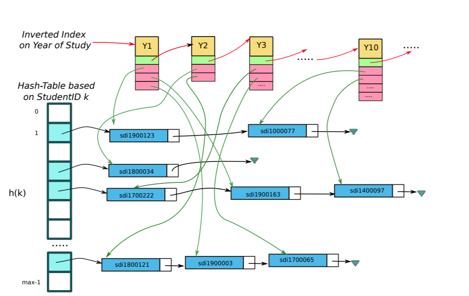

**NOTE :** *This repo , is a part of the 1st Programming assignment that we had to implement for the course of Operating Systems - Fall 2020.*

 
 <h1>Student Management using Data Structures </h1> 

 

This is a **Data Structures** based project , that is implemented by a Hash Table and and Inverted Index as you can see at the following picture .

 
 

